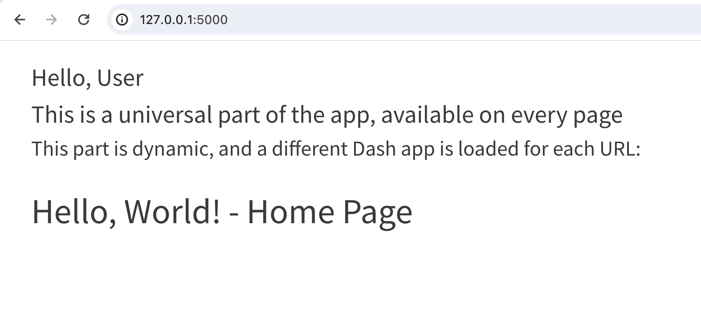
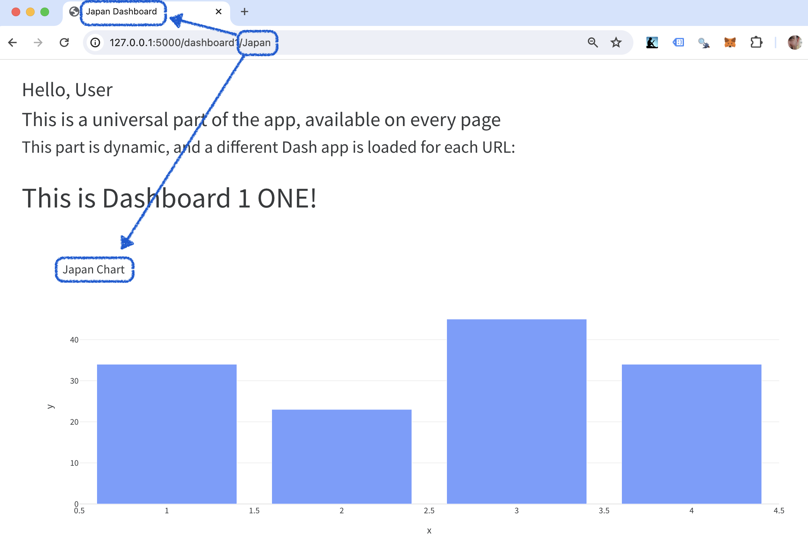
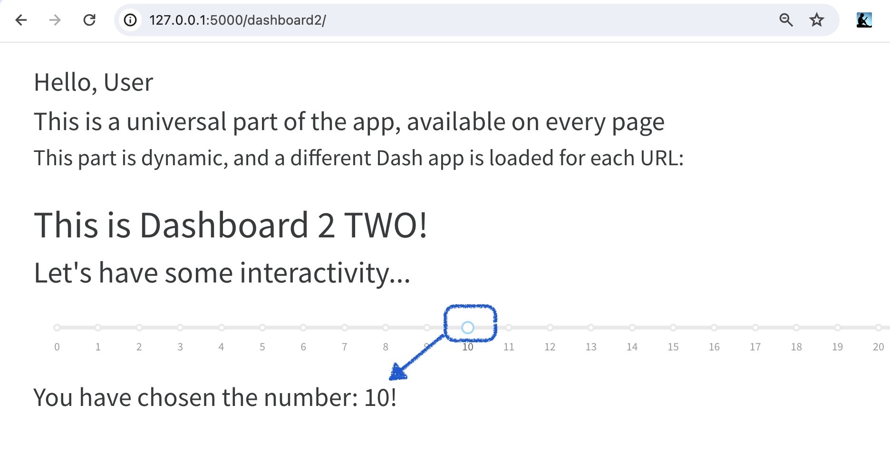

# v03 Creating interactive features based on the URL

* The URL now does more than display the right page, and insert the right app.
* We now use URL variables `/country/<country_name>/` to determine the title tag, and to control the title of our chart
* Here the URL is used by both: by Flask to set the title tag of the page, and by Dash to set the title of the chart
* Add a style sheet to the template
* We now have callbacks running on each of the apps. The app Dashboard1 has different callbacks from dashboard2 and they are independently manged.

### Home page with a style sheet


### Dashboard 1 with the URL determining title tag and chart title


### Dashboard 2 with an independent callback and separate funcitonality


To run:

```bash
cd v03/
export FLASK_APP=app.py
flask run
```
