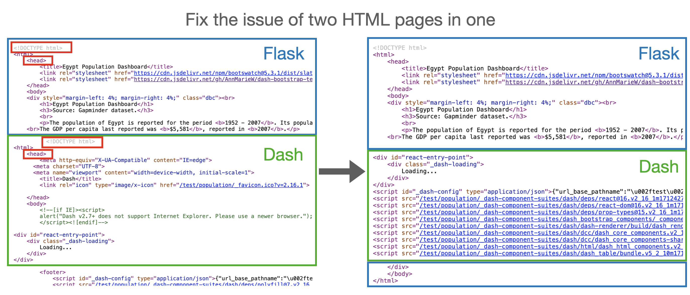
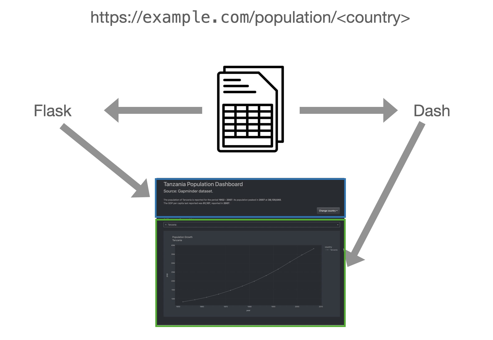

# v04 Refactoring & using a dataset to dynamically generate dashboards on a large scale

* Put apps in separate folders so they can potentially have their own data files (assets, templates, data, etc.)
* Create a new population dashboard for every country (URL)
* Three page elements are in play, in this sequence:
    * Dropdown changes URL, which changes default value of the dropdown, which creates the chart
* Allow the user to add more countries for comparison
* Title tag, h1, and summary are dynamically generated by Flask using the same dataset
* Dash and Flask now provide an HTML string for the page, which we solve by manipulating `Dash.index_string`


### Fixing the duplicate HTML string issue


### URL data used by Fask and Dash to independently set content of the page



To run:

```bash
cd v04/
export FLASK_APP=app.py
flask run
```
